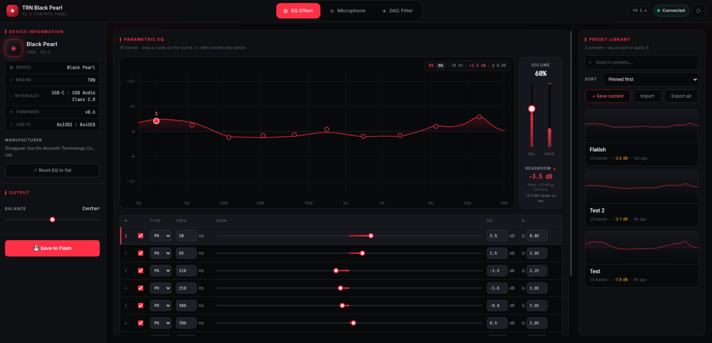
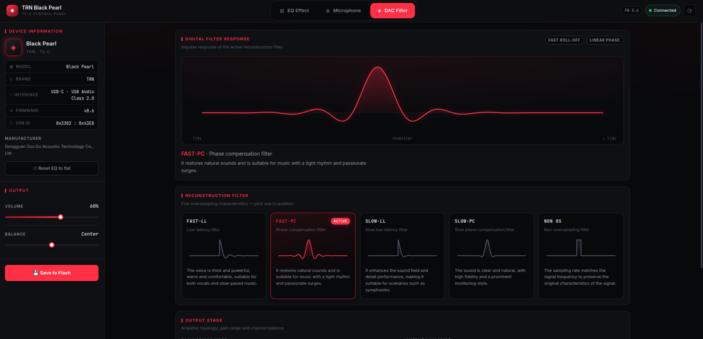
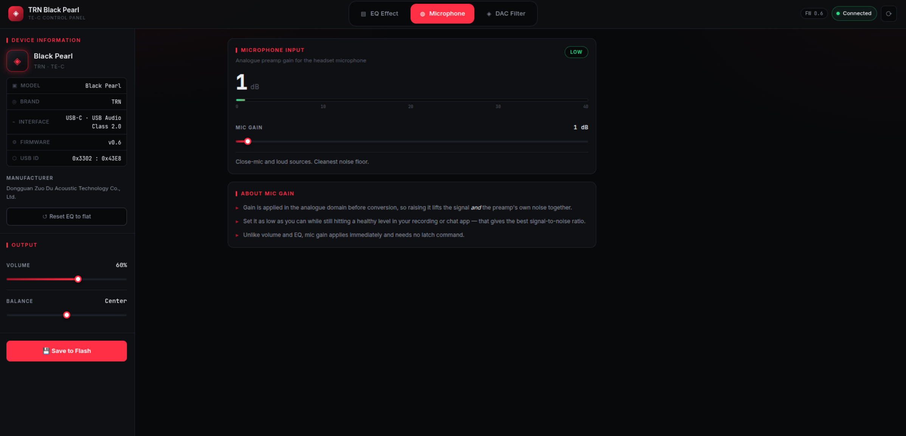
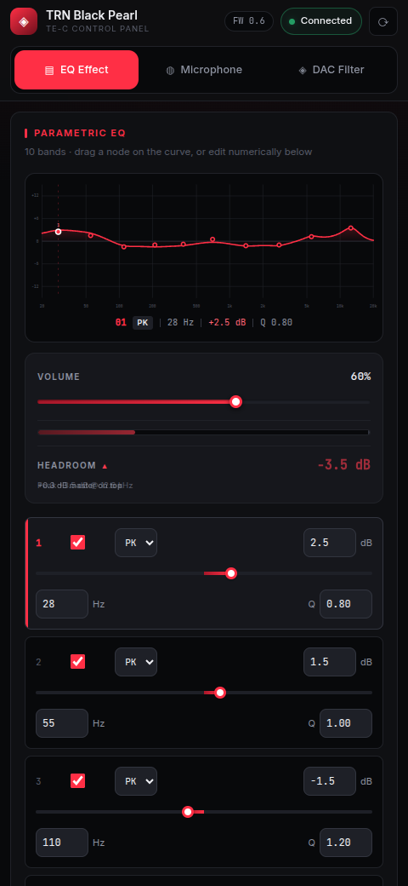

<div align="center">

# TRN Black Pearl Control Panel

**A fast, open-source desktop and mobile control panel for the TRN Black Pearl (TE-C) USB DAC — parametric EQ, preset library, and full device control.**

[](https://go.dev)
[](https://react.dev)
[](https://www.typescriptlang.org)
[](#installation)
[](#license)



</div>

---

## Overview

The TRN Black Pearl is an excellent little USB DAC, but the only way to configure it is a vendor web app that requires an account and an internet connection to change settings on hardware sitting on your desk.

This project replaces it. It's a self-contained control panel that talks to the DAC directly over USB HID, stores everything locally, and works entirely offline. No account, no telemetry, no cloud.

**Who it's for**

- Anyone with a TRN Black Pearl / TE-C who wants full control of their device.
- Listeners who tune by ear or follow measurement-based EQ targets and want a real preset workflow.
- Tinkerers curious about how these DACs work under the hood.

**Goals**

| | |
|---|---|
| **Local first** | Everything runs on your machine. The API binds to loopback only. |
| **Honest tooling** | Show real information — including when your EQ is about to clip. |
| **Fast** | Adjust a band, hear it immediately. No round trips to a server. |
| **Works everywhere** | One responsive interface for desktop, tablet, and phone. |

> [!NOTE]
> This is an unofficial, community-built project. It is not affiliated with or endorsed by TRN.

---

## Features

### Available now

**Parametric EQ**
- 10-band parametric EQ with peaking, low-shelf, and high-shelf filters
- Drag control points directly on the response curve, or type exact values
- Live combined frequency-response graph
- Per-band frequency, gain, Q, and enable toggle

**Headroom & clipping analysis**
- Continuously analyses the EQ curve for the peak boost it applies
- Reports the recommended preamp cut needed to stay below 0 dBFS
- Green / amber / red status with a live meter next to the volume control

**Preset library**
- Gallery of preset cards, each with a miniature EQ curve as a visual fingerprint
- Apply any preset to the device with a single click
- Save, rename, duplicate, delete, and pin favourites
- Tag presets with the headphone or IEM they were tuned for
- Search by name or target; sort by name, recently used, created, or modified
- Import and export as JSON to share or back up

**Device control**
- Master volume, channel balance, and microphone gain
- Five DAC reconstruction filters, each with its impulse response and a plain-English description
- Amplifier topology (Class-H / Class-AB) and output gain mode (Low / High)
- Save settings to the device's flash so they survive a power cycle
- Physical volume-button changes sync back to the UI in real time
- Hot-plug detection with a manual reconnect button

**Interface**
- Responsive layout for desktop, tablet, and mobile
- Flat dark theme with a red accent
- Preset library remains editable while the DAC is unplugged

**Desktop app**
- Native Linux desktop window via Tauri, packaged as a `.deb`
- Bundles the backend as a managed sidecar — one install, nothing else to run
- Shuts the backend down with the window, even if the app is force-killed

### Roadmap

- [ ] AppImage and Windows / macOS builds
- [ ] AutoEQ / Squiglink profile import
- [ ] Multiple device profiles
- [ ] Additional colour themes
- [ ] Firmware update support
- [ ] Resizable preset dock
- [ ] Packaged binaries and installers

---

## Screenshots

<table>
<tr>
<td width="50%">

**EQ editor & preset library**


</td>
<td width="50%">

**DAC filter selection**



</td>
</tr>
<tr>
<td width="50%">

**Microphone**



</td>
<td width="50%">

**Mobile layout**



</td>
</tr>
</table>

<!-- Additional screenshots to add:


-->

## Installation

### Prerequisites

- **Go** 1.22 or newer
- **Node.js** 18 or newer, with npm
- A **TRN Black Pearl / TE-C** DAC connected over USB

> [!IMPORTANT]
> **Linux users:** accessing USB HID devices normally requires root. To use the DAC as a
> regular user, add a udev rule:
>
> ```bash
> echo 'SUBSYSTEM=="hidraw", ATTRS{idVendor}=="3302", ATTRS{idProduct}=="43e8", MODE="0660", TAG+="uaccess"' \
>   | sudo tee /etc/udev/rules.d/70-trn-blackpearl.rules
> sudo udevadm control --reload-rules && sudo udevadm trigger
> ```
>
> Unplug and reconnect the DAC afterwards.

### Clone and install

```bash
git clone https://github.com/Matr1x01/trnBlackPearlEq.git
cd trnBlackPearlEq

# Backend dependencies
cd backend && go mod download && cd ..

# Frontend dependencies
cd frontend && npm install && cd ..
```

### Run it

The app is two processes: a Go sidecar that owns the USB connection, and the web UI.

**Terminal 1 — backend**

```bash
cd backend
go run .
```

It prints `READY 47823` once it is listening on `127.0.0.1:47823`.

**Terminal 2 — frontend**

```bash
cd frontend
npm run dev
```

Then open **http://localhost:5173**.

To use the interface from your phone on the same network, run `npm run dev -- --host` and
open the printed network address.

### Build for production

```bash
# Frontend assets -> frontend/dist/
cd frontend && npm run build

# Backend binary
cd backend && go build -o trncontrol-backend .
```

---

## Building the desktop app (Linux)

This produces a native window and a `.deb` you can install like any other app —
the backend is bundled inside and started automatically.

**1. Install the toolchain** (one time)

```bash
# Tauri's system dependencies
sudo apt install -y libwebkit2gtk-4.1-dev build-essential curl wget file \
  libxdo-dev libssl-dev libayatana-appindicator3-dev librsvg2-dev

# Rust + the Tauri CLI
curl --proto '=https' --tlsv1.2 -sSf https://sh.rustup.rs | sh -s -- -y
. "$HOME/.cargo/env"
cargo install tauri-cli --version "^2" --locked
```

> [!NOTE]
> Requires **Tauri v2** and `libwebkit2gtk-4.1`. Ubuntu 24.04 and newer no longer
> ship the `4.0` package that Tauri v1 needed. Budget roughly 4 GB of disk for the
> Rust toolchain and build cache.

**2. Build the Go backend as a sidecar**

Tauri locates sidecars by target triple, so the filename suffix matters:

```bash
TRIPLE=$(rustc -vV | grep '^host:' | cut -d' ' -f2)
mkdir -p src-tauri/binaries
cd backend
CGO_ENABLED=1 go build -trimpath -ldflags="-s -w" \
  -o "../src-tauri/binaries/trncontrol-backend-$TRIPLE" .
cd ..
```

**3. Build the app**

```bash
cd src-tauri
cargo tauri build
```

The installer lands in `src-tauri/target/release/bundle/deb/`:

```bash
sudo dpkg -i "src-tauri/target/release/bundle/deb/TRN Black Pearl Control_0.1.0_amd64.deb"
```

It then appears in your application menu as **TRN Black Pearl Control**. To run the
built binary without installing:

```bash
./src-tauri/target/release/trncontrol
```

For live development with hot reload, use `cargo tauri dev` instead.

> [!TIP]
> `cargo tauri build` also targets AppImage, which downloads tooling from GitHub at
> build time. If that download times out, build just the Debian package with
> `cargo tauri build --bundles deb`.

---

## Usage

**Build an EQ curve**

1. Open the **EQ Effect** tab.
2. Drag any of the ten control points on the graph — horizontally for frequency, vertically for gain.
3. For exact values, edit the frequency, gain, and Q fields in the band list below the graph.
4. Change a band's shape with the type selector (`PK` peaking, `LS` low shelf, `HS` high shelf), or switch it off with its checkbox.

Every change is written to the DAC immediately, so you hear it as you make it.

**Watch your headroom**

The meter beside the volume slider shows how much boost your curve applies. Green means you
have room; red means a loud track will clip. The reading tells you exactly how much to cut.

**Work with presets**

| Action | How |
|---|---|
| Save the current EQ | **+ Save current** in the preset library, then name it |
| Apply a preset | Click its card — it loads into the editor and goes to the DAC |
| Update a preset | Edit the EQ, then **Update active** |
| Rename / duplicate / delete | The **⋯** menu on a card |
| Pin a favourite | The **☆** on a card keeps it at the top |
| Tag a target | **⋯ → Set target** to record the headphone it was tuned for |
| Find one | Search by name or target, and sort by how recently you used it |
| Share or back up | **Export all**, or export a single preset from its **⋯** menu |

**Make it permanent**

Applying a preset changes the DAC live but does not persist it. Press **Save to Flash** to
write the current state to the device so it survives being unplugged. Flash memory has a
finite number of write cycles, so this is deliberately a separate, explicit action.

---

If you own a different TRN or TTGK device and want to help extend support, protocol captures
are especially useful.

## Acknowledgements

- **[cheesyserg/pyBlackPearl](https://github.com/cheesyserg/pyBlackPearl)** — the reverse
  engineering of the Black Pearl's HID protocol that made this project possible. This app's
  device layer is built on that work.
- The RBJ Audio EQ Cookbook, for the biquad formulas used by both the device and the UI.

## License

Not yet chosen. Until a license file is added, all rights are reserved — please open an issue
if you would like to use this code.

<!-- Suggested: MIT or Apache-2.0. Add a LICENSE file and update the badge at the top. -->

## Disclaimer

This is unofficial software that writes directly to your DAC's configuration and flash memory.
It has been tested on firmware v0.6, but use it at your own risk. The authors are not
responsible for any damage to your device.
